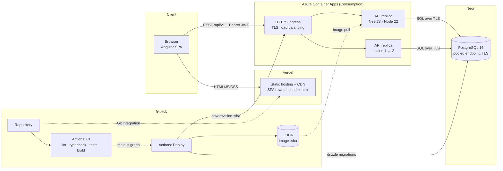
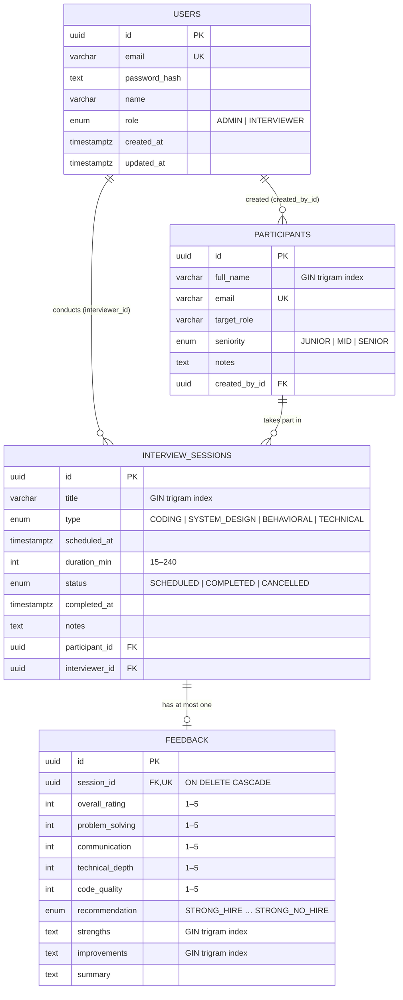

# Architecture Overview

## 1. System and deployment



**Data flow for a typical request**

1. The SPA is served from Vercel's CDN. Every route rewrites to `index.html`, so deep links and refreshes work.
2. The SPA calls the API directly at `https://<container-app>/api/v1/...`. An HTTP interceptor adds `Authorization: Bearer <JWT>`.
3. Azure's ingress terminates TLS and forwards the call to one of the stateless API replicas.
4. NestJS runs the request through its pipeline: throttler → JWT guard → roles guard → validation pipe → controller → service. The service applies business rules and ownership checks, then queries Postgres through Drizzle ORM.
5. Errors anywhere in that chain are converted into a single JSON shape by a global exception filter.

## 2. Request lifecycle (example: saving feedback)

```mermaid
sequenceDiagram
    autonumber
    participant UI as Angular (feedback form)
    participant INT as HTTP interceptor
    participant G as Guards (throttle · JWT · roles)
    participant VP as ValidationPipe
    participant C as FeedbackController
    participant S as FeedbackService
    participant SS as SessionsService
    participant DB as PostgreSQL

    UI->>INT: PUT /sessions/:id/feedback {scores, recommendation, text}
    INT->>G: + Authorization: Bearer JWT
    G-->>INT: 401 if token missing/invalid · 429 if throttled
    G->>VP: authenticated user on request
    VP-->>INT: 400 if body invalid (scores 1–5, unknown fields rejected)
    VP->>C: typed UpsertFeedbackDto
    C->>S: upsert(sessionId, dto, user)
    S->>SS: findOneOwned(sessionId, user)
    SS->>DB: SELECT … WHERE id = $1 AND interviewer_id = $2 (unless ADMIN)
    SS-->>S: 404 if missing OR not owned (existence not leaked)
    S-->>C: 409 if session not COMPLETED
    S->>DB: INSERT … ON CONFLICT (session_id) DO UPDATE
    DB-->>S: feedback row
    S-->>UI: 200 feedback JSON
    Note over INT,UI: Any error → snackbar with the API's message; 401 → logout
```

## 3. Data model



**Indexes and why they exist**

| Index | Serves |
|---|---|
| `interview_sessions (interviewer_id, scheduled_at)` | An interviewer's session list, sorted by date (the most common query) |
| `interview_sessions (participant_id, scheduled_at)` | A participant's interview history and progress chart |
| `interview_sessions (status)` | Status filters and dashboard counters |
| GIN `pg_trgm` on participant name, session title, feedback strengths/improvements | `ILIKE '%term%'` search stays index-backed as the data grows |
| Unique `users.email`, `participants.email`, `feedback.session_id` | Integrity (one feedback per session), surfaced to clients as `409` |

**Status lifecycle:** `SCHEDULED → COMPLETED` (sets `completed_at`) or `SCHEDULED → CANCELLED`. No other transitions are allowed. The update's `WHERE status = 'SCHEDULED'` clause makes concurrent transitions safe. Once a session is closed, only `notes` can change, and feedback can only be recorded for `COMPLETED` sessions.

## 4. Backend structure

```
api/src
├── app.setup.ts        prefix, helmet, CORS, ValidationPipe, exception filter, Swagger (shared with tests)
├── auth/               register/login/me, JWT strategy, global JWT + roles guards, throttling
├── participants/       shared participant directory (CRUD, search, pagination)
├── sessions/           sessions CRUD, filters/sort, status transitions (pure rules in session-rules.ts), ownership
├── feedback/           one feedback per completed session (upsert)
├── search/             global search across participants / sessions / feedback (scoped)
├── reports/            SQL aggregations: summary + per-participant trends
├── health/             liveness/readiness with a DB ping (503 when the DB is unreachable)
├── common/             error filter, pagination DTO, decorators, input transforms, LIKE escaping
└── db/                 Drizzle schema, DB service (pg pool), migrate + seed scripts
```

Each domain module follows the same layering: **controller** (HTTP, DTO validation, Swagger) → **service** (business rules, ownership, queries) → **Drizzle/Postgres**.

## 5. Deployment approach

| Concern | Choice |
|---|---|
| Packaging | Multi-stage Dockerfile (`node:22-alpine`, production dependencies only, runs as non-root `node`, with a `HEALTHCHECK`) |
| Registry | GitHub Container Registry, with images tagged by commit SHA plus `main` |
| API runtime | Azure Container Apps, Consumption plan: 0.25 vCPU / 0.5 GiB, 1–2 replicas, HTTP liveness/readiness probes on `/api/v1/health` |
| Secrets | Container Apps secrets (`database-url`, `jwt-secret`) referenced as environment variables, plus GitHub Actions secrets for CI/CD. Nothing secret lives in the image or the repo. |
| Database | Neon serverless Postgres (pooled endpoint, TLS required) |
| Schema changes | SQL migrations generated by drizzle-kit, applied by the pipeline **before** the new revision is deployed. A failing migration stops the release. |
| Frontend | Vercel Git integration (production builds from `main`, preview URLs for branches) |
| CI | Every push and PR: API lint, typecheck, unit tests, e2e tests against a real Postgres service container, build. Web: unit tests, production build. |
| CD | Runs on a green CI for `main`: build and push the image, migrate, deploy a new Container Apps revision. A Render deploy hook is wired in as a fallback. |
| Cost | About $0. The Container Apps free grant covers one small warm replica, and GHCR, Neon and Vercel are on free tiers. |

**Scaling path.** The API is stateless, so horizontal scaling only means raising `max-replicas` or adding HTTP-concurrency scale rules. Postgres connections go through Neon's pooler with a small per-replica pool (`DB_POOL_MAX`, default 5). The next steps would be:
- a shared rate-limit store (Redis), so throttling holds across replicas
- caching of dashboard aggregates
- cursor pagination for very large lists
- read replicas for reporting
